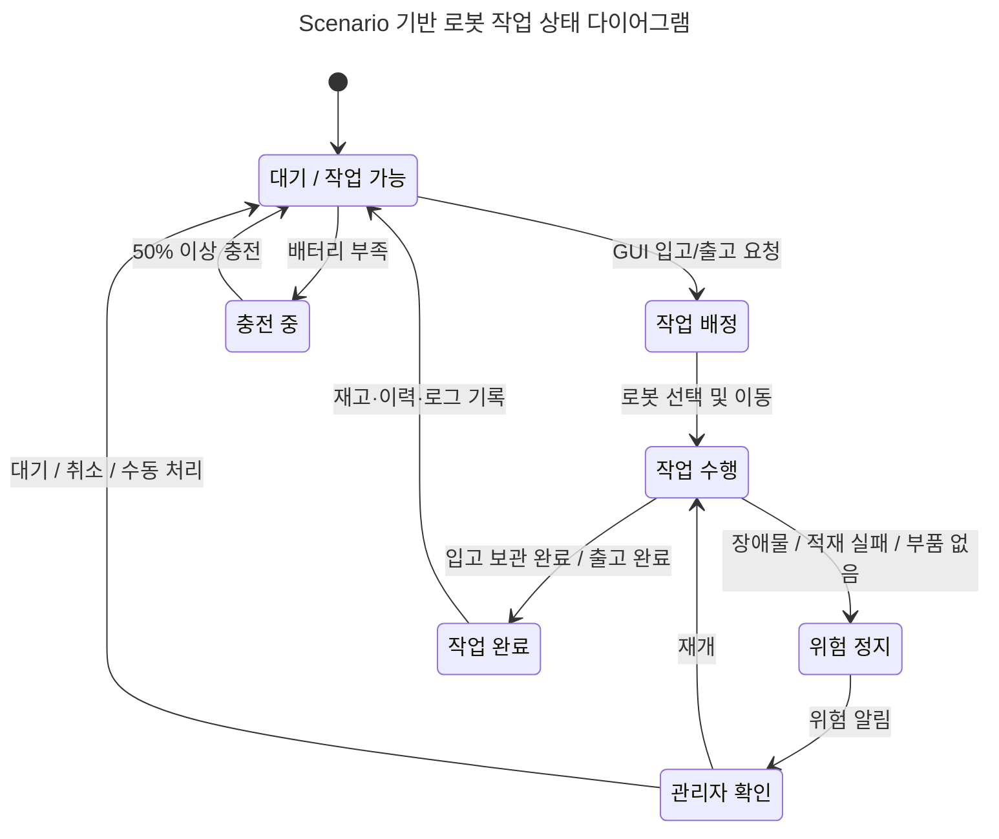

# State Diagram

## 정정 사항
- 기준 문서를 `Scenario` 문서로 정정했다: https://baksa2584.atlassian.net/wiki/x/DgDq
- Confluence에서 Mermaid 코드블록이 그림으로 렌더링되지 않는 문제를 피하기 위해, 웹 표시용 렌더링 이미지를 먼저 배치하고 원본 Mermaid 코드는 아래에 보존한다.

## 목적
Scenario 문서의 4개 시나리오를 기준으로 로봇의 공통 상태 전이를 단순화한다.

## Scenario 기준 요약
- Scenario #1 입고 및 보관: GUI 등록 → 로봇 선택 → 입고 구역 이동 → 부품 적재 → 창고 이동 → 보관 완료 → 재고/이력/로그 갱신 → 대기 또는 충전 구역 이동
- Scenario #2 출고: GUI 요청 → 재고/위치 확인 → 로봇 선택 → 창고 이동 → 부품 적재 → 출고 구역 이동 → 출고 완료 → 재고/이력/로그 갱신 → 대기 또는 충전 구역 이동
- Scenario #3 위험 대응: 이동 중 장애물/위험 감지 → 즉시 정지 → 위험 알림 → 관리자 확인 → 재개·대기·취소·수동 처리
- Scenario #4 충전 대기: 배터리 부족 시 새 작업 제외 → 충전 구역 이동 → 충전 중 → 50% 이상 충전 시 작업 가능 복귀

## 웹 표시용 그림

![Scenario 기반 로봇 작업 상태 다이어그램](https://mermaid.ink/img/LS0tCnRpdGxlOiBTY2VuYXJpbyDquLDrsJgg66Gc67SHIOyekeyXhSDsg4Htg5wg64uk7J207Ja06re4656oCi0tLQpzdGF0ZURpYWdyYW0tdjIKICAgIGRpcmVjdGlvbiBUQgoKICAgIHN0YXRlICLrjIDquLAgLyDsnpHsl4Ug6rCA64qlIiBhcyBpZGxlCiAgICBzdGF0ZSAi7J6R7JeFIOuwsOyglSIgYXMgYXNzaWduCiAgICBzdGF0ZSAi7J6R7JeFIOyImO2WiSIgYXMgd29yawogICAgc3RhdGUgIuychO2XmCDsoJXsp4AiIGFzIHN0b3AKICAgIHN0YXRlICLqtIDrpqzsnpAg7ZmV7J24IiBhcyBjb25maXJtCiAgICBzdGF0ZSAi7Lap7KCEIOykkSIgYXMgY2hhcmdpbmcKICAgIHN0YXRlICLsnpHsl4Ug7JmE66OMIiBhcyBkb25lCgogICAgWypdIC0tPiBpZGxlCiAgICBpZGxlIC0tPiBhc3NpZ246IEdVSSDsnoXqs6Av7Lac6rOgIOyalOyyrQogICAgaWRsZSAtLT4gY2hhcmdpbmc6IOuwsO2EsOumrCDrtoDsobEKICAgIGNoYXJnaW5nIC0tPiBpZGxlOiA1MCUg7J207IOBIOy2qeyghAoKICAgIGFzc2lnbiAtLT4gd29yazog66Gc67SHIOyEoO2DnSDrsI8g7J2064-ZCiAgICB3b3JrIC0tPiBkb25lOiDsnoXqs6Ag67O06rSAIOyZhOujjCAvIOy2nOqzoCDsmYTro4wKICAgIGRvbmUgLS0-IGlkbGU6IOyerOqzoMK37J2066ClwrfroZzqt7gg6riw66GdCgogICAgd29yayAtLT4gc3RvcDog7J6l7JWg66y8IC8g7KCB7J6sIOyLpO2MqCAvIOu2gO2SiCDsl4bsnYwKICAgIHN0b3AgLS0-IGNvbmZpcm06IOychO2XmCDslYzrprwKICAgIGNvbmZpcm0gLS0-IHdvcms6IOyerOqwnAogICAgY29uZmlybSAtLT4gaWRsZTog64yA6riwIC8g7Leo7IaMIC8g7IiY64-ZIOyymOumrAo)

SVG 원본 보기: https://mermaid.ink/svg/LS0tCnRpdGxlOiBTY2VuYXJpbyDquLDrsJgg66Gc67SHIOyekeyXhSDsg4Htg5wg64uk7J207Ja06re4656oCi0tLQpzdGF0ZURpYWdyYW0tdjIKICAgIGRpcmVjdGlvbiBUQgoKICAgIHN0YXRlICLrjIDquLAgLyDsnpHsl4Ug6rCA64qlIiBhcyBpZGxlCiAgICBzdGF0ZSAi7J6R7JeFIOuwsOyglSIgYXMgYXNzaWduCiAgICBzdGF0ZSAi7J6R7JeFIOyImO2WiSIgYXMgd29yawogICAgc3RhdGUgIuychO2XmCDsoJXsp4AiIGFzIHN0b3AKICAgIHN0YXRlICLqtIDrpqzsnpAg7ZmV7J24IiBhcyBjb25maXJtCiAgICBzdGF0ZSAi7Lap7KCEIOykkSIgYXMgY2hhcmdpbmcKICAgIHN0YXRlICLsnpHsl4Ug7JmE66OMIiBhcyBkb25lCgogICAgWypdIC0tPiBpZGxlCiAgICBpZGxlIC0tPiBhc3NpZ246IEdVSSDsnoXqs6Av7Lac6rOgIOyalOyyrQogICAgaWRsZSAtLT4gY2hhcmdpbmc6IOuwsO2EsOumrCDrtoDsobEKICAgIGNoYXJnaW5nIC0tPiBpZGxlOiA1MCUg7J207IOBIOy2qeyghAoKICAgIGFzc2lnbiAtLT4gd29yazog66Gc67SHIOyEoO2DnSDrsI8g7J2064-ZCiAgICB3b3JrIC0tPiBkb25lOiDsnoXqs6Ag67O06rSAIOyZhOujjCAvIOy2nOqzoCDsmYTro4wKICAgIGRvbmUgLS0-IGlkbGU6IOyerOqzoMK37J2066ClwrfroZzqt7gg6riw66GdCgogICAgd29yayAtLT4gc3RvcDog7J6l7JWg66y8IC8g7KCB7J6sIOyLpO2MqCAvIOu2gO2SiCDsl4bsnYwKICAgIHN0b3AgLS0-IGNvbmZpcm06IOychO2XmCDslYzrprwKICAgIGNvbmZpcm0gLS0-IHdvcms6IOyerOqwnAogICAgY29uZmlybSAtLT4gaWRsZTog64yA6riwIC8g7Leo7IaMIC8g7IiY64-ZIOyymOumrAo

## 원본 Mermaid



## 상태 정의

| 상태 | 의미 |
| --- | --- |
| 대기 / 작업 가능 | 새 작업을 받을 수 있는 기본 상태 |
| 작업 배정 | GUI 입고/출고 요청 후 시스템이 작업 가능 로봇을 선택하는 상태 |
| 작업 수행 | 입고·보관 또는 출고 작업을 실제로 수행하는 상태 |
| 위험 정지 | 장애물, 적재 실패, 부품 없음 등으로 로봇이 정지한 상태 |
| 관리자 확인 | 위험 알림 후 관리자가 재개·대기·취소·수동 처리 중 하나를 판단하는 상태 |
| 충전 중 | 배터리 부족으로 충전 구역에서 충전하는 상태 |
| 작업 완료 | 입고 보관 또는 출고 완료 후 재고·이력·로그를 기록하는 상태 |

## DESIGN.md 기준 및 시각적 에러 정의

```text
# 단순 상태 다이어그램 디자인 원칙

## 기준 문서
- Confluence: Scenario (`https://baksa2584.atlassian.net/wiki/x/DgDq`, pageId `15335438`)
- 이전에 참조한 요구사항/아키텍처 문서는 보조 자료로만 취급하고, 상태 전이의 기준은 Scenario 문서로 둔다.

## 목표
- Scenario #1 입고 및 보관, #2 출고, #3 장애물 및 위험 상황 대응, #4 충전 대기의 공통 로봇 상태 흐름을 단순한 state diagram으로 표현한다.
- 웹 Confluence에서 그림이 보이지 않는 Mermaid 코드블록 문제를 피하기 위해 렌더링 이미지 링크와 원본 Mermaid 코드를 함께 둔다.

## 시각적 에러 정의
다음 중 하나라도 있으면 시각적 에러로 본다.
1. 상태 노드 텍스트가 잘리거나 서로 겹치는 경우
2. 전이 라벨이 선/노드와 겹쳐 읽기 어려운 경우
3. Scenario에 없는 흐름을 핵심 정상 흐름처럼 표현하는 경우
4. 입고/출고/위험/충전 흐름 중 하나가 누락되는 경우
5. 작업 완료 후 작업 로그 기록 및 대기/충전 복귀가 모호한 경우
6. 위험 상황에서 정지 → 관리자 확인 → 재개/대기·취소 흐름이 보이지 않는 경우
7. 충전 조건에서 충전 구역 이동 → 충전 중 → 작업 가능 복귀가 보이지 않는 경우
8. Mermaid 렌더링 문법 오류가 발생하는 경우
9. Confluence에서 그림이 코드블록으로만 보이고 이미지로 보이지 않는 경우

## 스타일 원칙
- Mermaid `stateDiagram-v2`를 기준 원본으로 유지한다.
- 상태 수는 최소화하되 Scenario 4개를 모두 포함한다.
- 한국어 상태명은 별칭(alias)으로 선언해 렌더링 안정성을 높인다.
- 정상 흐름과 예외 흐름을 모두 표시하되 상세 센서/서버 내부 동작은 제외한다.
- Confluence 본문에는 이미지 링크를 먼저 보여주고, 원본 Mermaid 코드는 아래에 둔다.

```

## 검수 결과
- 기준 문서 검수: `Scenario` pageId `15335438` 내용을 재조회해 반영
- 렌더링 검수: Mermaid CLI로 PNG/SVG 생성 성공
- 웹 표시 검수: `mermaid.ink/img` 이미지 URL HTTP 200 및 `image/jpeg` 응답 확인
- 시각 검수: 핵심 상태 누락 없음, 입고/출고 정상 흐름·위험 대응·충전 복귀 흐름 포함
