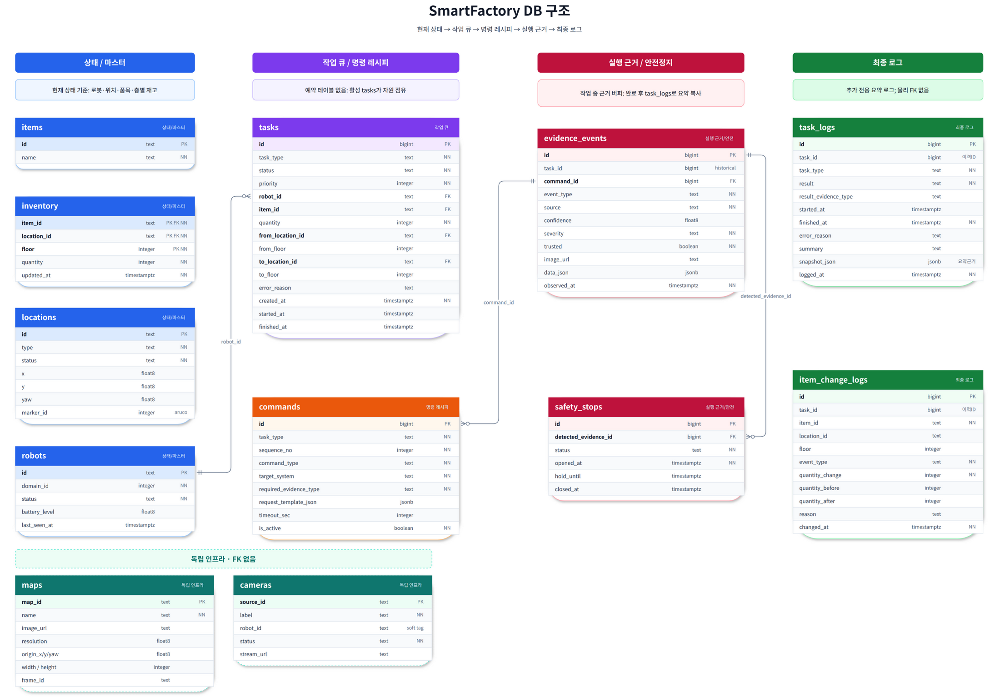

# Data Structure

상태: Active
소유: DB
작성: 2026-06-26 09:00 KST
최종 갱신: 2026-06-30 11:43 KST
목적: Main Server DB의 작업 큐·명령 레시피·evidence·안전정지·최종 로그 구조를 정의한다.

> 이 문서는 **업무 정본 10테이블**을 정의한다. `maps`·`cameras`는 참조 없는 **독립 인프라 2테이블**로 함께 표시하되, 업무 정본 FK 흐름과는 분리한다. compat(`movement_commands`·`events`·`waypoints`·`dock_pairs`)는 정본 구조로 흡수·은퇴하는 방향이다.



> 시각화 산출물: [draw.io source](visualizations/dbdiagram/final/smartfactory-db-final-overview.drawio), [editable PNG](visualizations/dbdiagram/final/smartfactory-db-final-overview.drawio.png), [SVG](visualizations/dbdiagram/final/smartfactory-db-final-overview.svg), [DBML source](visualizations/dbdiagram/final/smartfactory-db-final.dbml)

## 1. 설계 핵심

이 DB 구조의 핵심은 **현재 상태와 영구 이력을 분리**하는 것이다.

- `tasks`는 영구 이력 테이블이 아니라 **현재 작업 큐**다.
- `commands`는 task마다 생성되는 실행 row가 아니라 **`task_type`별 API 호출 레시피**다.
- `evidence_events`는 작업 중 command 진행과 safety 판단에 쓰는 **runtime evidence buffer**다.
- `safety_stops`는 로그가 아니라 **현재 안전 HOLD 상태를 잡아두는 mutable latch**다.
- 작업이 끝나면 필요한 근거만 `task_logs.snapshot_json`에 compact하게 복사하고 `evidence_events`는 정리할 수 있다.
- 영구 보관 대상은 `task_logs`, `item_change_logs`다.
- 별도 `reservations` 테이블은 두지 않는다. **완료되지 않은 active task 자체가 자원 점유 상태**다.
- `locations`는 입고/출고/보관/대기/충전/도크에 더해 **스캔 마커 위치(`type='scan'`)까지** 포함한다. 과거 `waypoints`의 zone·aruco 정보는 `locations.type` + `locations.marker_id`로 흡수한다(PHASE_66). `locations.type`은 DBML에서 free text라 값 추가는 정본을 바꾸지 않는다.
- `maps`·`cameras`는 업무 상태가 아니라 **장비/맵 자산**이라 정본 10에 넣지 않고 **참조 없는 독립 인프라 테이블**로 둔다. `cameras.robot_id`는 FK가 아닌 soft tag다.

한 문장으로 정리하면 다음과 같다.

> Main Server는 `tasks`를 작업 큐로 사용하고, `commands`를 task type별 실행 레시피로 조회하며, `evidence_events`로 실행 근거를 판단한다. 안전 이벤트가 발생하면 `safety_stops`로 로봇을 일시 HOLD하고, 최종 결과만 `task_logs`와 `item_change_logs`에 영구 기록한다.

## 2. 테이블 그룹

| 그룹 | 테이블 | 보관 성격 | 책임 |
| --- | --- | --- | --- |
| 상태 / 마스터 | `robots`, `locations`, `items`, `inventory` | 현재 상태 | 로봇, 위치, 품목, 층별 재고 상태 |
| 작업 큐 | `tasks` | 현재 상태 | 우선순위 작업 큐이자 active 자원 점유 상태 |
| 명령 레시피 | `commands` | 정의 데이터 | `task_type`별 API 호출 순서와 필요한 evidence 명세 |
| 실행 근거 / 안전정지 | `evidence_events`, `safety_stops` | 작업 중 상태 | command 진행 근거와 안전 HOLD/RESUME 상태 (`evidence_events`가 구 `events`·`movement_commands` 타임라인 흡수) |
| 최종 로그 | `task_logs`, `item_change_logs` | 영구 이력 | 작업 결과 요약과 재고 변경 이력 |
| 독립 인프라 (범위 밖) | `maps`, `cameras` | 자산 설정 | 맵 메타·카메라 레지스트리. **FK 없음**, 정본 10에 미포함 |

## 3. 작업 처리 흐름

```text
1. Main Server가 tasks에 작업을 생성한다 (status=CREATED 또는 QUEUED).
2. QUEUED/CREATED task 중 priority가 높은 작업을 선택한다.
3. robot_id를 배정하고 status를 ASSIGNED/RUNNING으로 바꾼다.
4. tasks.task_type 기준으로 commands를 sequence_no 순서대로 조회한다.
5. 각 command를 실행하고 결과/센서/카메라 근거를 evidence_events에 저장한다.
6. evidence_events가 commands.required_evidence_type을 만족하면 다음 command로 진행한다.
7. 안전 위험 evidence가 발생하면 safety_stops를 OPEN/HOLDING으로 만들고 ROS 쪽에 HOLD를 전달한다.
8. hold_until 만료 또는 SAFETY_CLEAR evidence 이후 safety_stops를 CLOSED로 바꾸고 기존 nav/task를 재개한다.
9. 모든 command 근거가 충족되면 inventory를 갱신한다.
10. item_change_logs에 재고 변경 이력을 남긴다.
11. task_logs에 최종 결과와 compact evidence snapshot을 남긴다.
12. 완료된 tasks, evidence_events, closed safety_stops는 정리할 수 있다.
```

## 4. safety_stops와 ROS HOLD 흐름

`safety_stops`는 단순 로그가 아니라 **현재 로봇을 잠시 멈춰야 하는 안전 상태 latch**다. `evidence_events`가 “위험이 감지되었다”는 사실을 남긴다면, `safety_stops`는 “아직 멈춰 있어야 하는가?”를 빠르게 판단하기 위한 현재 상태다.

```text
위험 evidence 발생
→ evidence_events row 생성
→ safety_stops.status = OPEN/HOLDING
→ Main Server 또는 ROS bridge가 Safety Gate / cmd_vel mux에 HOLD 전달
→ nav goal은 취소하지 않고 velocity만 0 또는 hold 상태 유지
→ hold_until 만료 또는 SAFETY_CLEAR evidence 발생
→ safety_stops.status = CLOSED
→ 기존 nav/task 재개
```

권장 ROS 제어 구조:

```text
Nav2 / navigation command
        ↓
Safety Gate / CmdVel Mux
        ↓
Robot base controller
```

이 구조에서는 `safety_stops.status = OPEN`인 동안 nav가 계속 속도 명령을 내더라도 Safety Gate가 막고 `0 velocity` 또는 `hold`를 내보낸다. 따라서 task/nav를 실패 처리하지 않고 잠시 대기시킨 뒤 재개할 수 있다.

주요 상태 전이:

```text
tasks.status: RUNNING → (safety_stops OPEN/HOLDING 동안 velocity hold) → RUNNING
safety_stops.status: OPEN/HOLDING → CLOSED
```

`tasks.status`에는 `BLOCKED` 값을 두지 않는다 (DDL CHECK). 안전 정지는 `safety_stops` latch로 표현하고, task는 `RUNNING`을 유지한 채 Movement/ROS HOLD만 적용한다.

`hold_until`은 “몇 초 동안만 정지” 같은 timed hold를 표현하기 위한 선택 필드다.

## 5. active task 기반 자원 점유

별도 `reservations` 테이블은 사용하지 않는다. 완료되지 않은 task가 곧 로봇/위치/층의 자원 점유 상태다.

로봇 점유 확인 예시:

```sql
SELECT 1
FROM tasks
WHERE robot_id = 'tb3_1'
  AND status IN ('ASSIGNED', 'RUNNING');
```

안전 HOLD 중에도 task status는 `RUNNING`일 수 있다. HOLD 여부는 `safety_stops`에서 조회한다.

목적지 슬롯/층 점유 확인 예시:

```sql
SELECT 1
FROM tasks
WHERE to_location_id = 'STORAGE_A_01'
  AND to_floor = 2
  AND status IN ('ASSIGNED', 'RUNNING');
```

출발 슬롯/층 점유 확인 예시:

```sql
SELECT 1
FROM tasks
WHERE from_location_id = 'STORAGE_A_01'
  AND from_floor = 2
  AND status IN ('ASSIGNED', 'RUNNING');
```

## 6. commands는 task 실행 로그가 아니라 레시피다

`commands`는 task 실행 때마다 무한히 늘어나는 테이블이 아니다. `task_type + sequence_no`로 정의되는 정적 레시피다.

예시:

| task_type | sequence_no | command_type | required_evidence_type |
| --- | ---: | --- | --- |
| INBOUND | 1 | NAV_GOAL | NAV_REACHED |
| INBOUND | 2 | PICK_UP | ITEM_PICKED |
| INBOUND | 3 | NAV_GOAL | NAV_REACHED |
| INBOUND | 4 | DROP_OFF | ITEM_PLACED |

실행 중 상태는 `commands`에 쌓지 않고, `evidence_events.task_id + evidence_events.command_id` 조합으로 판단한다.

## 7. evidence_events는 작업 중 근거 버퍼다

`evidence_events`는 command 진행과 safety 판단의 근거다. 단, 영구 로그로 무조건 보존하지 않는다.

- 작업 중: raw evidence 저장
- 작업 완료/실패/취소 시: 필요한 필드만 `task_logs.snapshot_json`에 복사
- 이후: 해당 task의 `evidence_events`는 삭제 가능

`task_logs.snapshot_json`에 복사하는 evidence는 compact해야 한다. 이미지 바이너리나 큰 payload 전체를 복사하지 않고, 판단 설명에 필요한 작은 필드만 남긴다.

예시:

```json
{
  "task": {
    "robot_id": "tb3_1",
    "item_id": "BOX_A",
    "quantity": 1,
    "from_location_id": "STORAGE_01",
    "from_floor": 2,
    "to_location_id": "OUTBOUND_01",
    "to_floor": 1
  },
  "decisive_evidence": {
    "command_id": 4,
    "event_type": "ITEM_PLACED",
    "source": "camera_01",
    "confidence": 0.94,
    "severity": "INFO",
    "trusted": true,
    "image_url": "...",
    "observed_at": "...",
    "data": {
      "marker_id": 12,
      "slot": "OUTBOUND_01",
      "floor": 1
    }
  },
  "supporting_evidence": [
    {
      "command_id": 1,
      "event_type": "NAV_REACHED",
      "source": "nav_server",
      "confidence": null,
      "severity": "INFO",
      "trusted": true,
      "observed_at": "...",
      "data": {
        "distance_m": 0.08
      }
    }
  ]
}
```

## 8. inventory floor

슬롯은 최대 2층까지 존재하므로 `inventory` 기본키는 다음 조합이다.

```text
(item_id, location_id, floor)
```

`floor`는 `1` 또는 `2`만 허용하는 CHECK 제약을 구현 단계에서 추가한다.

```sql
CHECK (floor IN (1, 2))
```

`tasks`도 출발/도착 층을 가진다.

```text
from_location_id, from_floor
to_location_id, to_floor
```

위치 ID는 `locations.id`를 참조하고, floor는 숫자 값으로만 관리한다.

## 9. DBML

정본 파일: `docs/technical/visualizations/dbdiagram/final/smartfactory-db-final.dbml`

```dbml
Project SmartFactory_CurrentState_TaskQueue_RuntimeEvidence_FinalLogs {
  database_type: 'PostgreSQL'
  Note: '''
  SmartFactory MVP DB model — business 10 tables (PG aligned).

  Principle:
  - Current-state tables may be updated/deleted after task completion.
  - task_logs and item_change_logs are append-only and intentionally do not FK back to current-state rows.
  - commands is a static command definition table keyed by task_type + sequence_no.
  - Runtime command progress/status is derived from evidence_events while a task is active.
  - evidence_events absorbs former compat events + movement_commands timelines.
  - safety_stops is a mutable current-state latch for temporary HOLD/RESUME control.
  - No reservations table: active tasks themselves are the resource claims.
  - maps and cameras are standalone infra (no FK) and live outside this business model.
  '''
}

/*
  Stable/current master tables
*/

Table items {
  id text [pk]
  name text [not null]
}

Table robots {
  id text [pk]
  domain_id integer [not null]
  status text [not null]
  battery_level float8
  last_seen_at timestamptz
}

Table locations {
  id text [pk]
  type text [not null, note: 'inbound/outbound/storage/home/charge/dock/transit/scan']
  status text [not null]
  x float8
  y float8
  yaw float8
  marker_id integer [note: 'aruco; absorbs former waypoints.aruco_marker_id']
}

Table inventory {
  item_id text [not null]
  location_id text [not null]
  floor integer [not null, default: 1, note: '1 or 2; enforce CHECK floor in (1, 2)']
  quantity integer [not null]
  updated_at timestamptz [not null]

  indexes {
    (item_id, location_id, floor) [pk]
    location_id
    (location_id, floor)
  }
}

/*
  Mutable current task queue.
  Finished tasks are copied/summarized into task_logs, then removable.
*/
Table tasks {
  id bigint [pk, increment]
  task_type text [not null]
  status text [not null]
  priority integer [not null]

  robot_id text
  item_id text
  quantity integer [not null]
  from_location_id text
  from_floor integer [note: '1 or 2 when the source is a stacked slot']
  to_location_id text
  to_floor integer [note: '1 or 2 when the target is a stacked slot']

  error_reason text
  created_at timestamptz [not null]
  started_at timestamptz
  finished_at timestamptz

  indexes {
    (status, priority, created_at)
    (robot_id, status)
    item_id
    (from_location_id, from_floor, status)
    (to_location_id, to_floor, status)
    created_at
  }
}

/*
  Static API command definitions for each task_type.
  This table does not grow per task execution.
  Runtime progress is derived from evidence_events for a specific task_id + command_id.
*/
Table commands {
  id bigint [pk, increment]

  task_type text [not null]
  sequence_no integer [not null]

  command_type text [not null]
  target_system text [not null]
  required_evidence_type text [not null]

  request_template_json jsonb
  timeout_sec integer
  is_active boolean [not null, default: true]

  indexes {
    (task_type, sequence_no) [unique]
    task_type
    command_type
    target_system
    required_evidence_type
    is_active
  }
}

/*
  Runtime evidence/event buffer.
  This is the proof source for command progress/status and safety stop creation while a task is active.
  After task completion, copy the decisive/supporting proof into task_logs.snapshot_json,
  then these rows can be deleted.
*/
Table evidence_events {
  id bigint [pk, increment]

  task_id bigint
  command_id bigint

  event_type text [not null]
  source text [not null]

  confidence float8
  severity text [not null]
  trusted boolean [not null]

  image_url text
  data_json jsonb

  observed_at timestamptz [not null]

  indexes {
    task_id
    command_id
    event_type
    severity
    trusted
    observed_at
  }
}

/*
  Mutable current safety-hold state.
  It points only to the evidence that caused the hold.
  Main Server can push a temporary ROS HOLD/zero-velocity gate while preserving the current navigation goal.
  hold_until is optional: when set, the hold can be auto-closed/resumed after that timestamp if no new critical evidence exists.
*/
Table safety_stops {
  id bigint [pk, increment]

  detected_evidence_id bigint [not null]

  status text [not null, note: 'OPEN/HOLDING/CLOSED']
  opened_at timestamptz [not null]
  hold_until timestamptz [note: 'optional timed hold deadline for temporary ROS hold']
  closed_at timestamptz

  indexes {
    detected_evidence_id
    status
    hold_until
    opened_at
  }
}

/*
  Append-only inventory-change log.
  No FK to tasks/inventory/items/locations, because this must survive cleanup.
  item_id/location_id are audit snapshot values.
*/
Table item_change_logs {
  id bigint [pk, increment]

  task_id bigint
  item_id text [not null]
  location_id text
  floor integer

  event_type text [not null]
  quantity_change integer [not null]
  quantity_before integer
  quantity_after integer

  reason text
  changed_at timestamptz [not null]

  indexes {
    task_id
    item_id
    location_id
    floor
    event_type
    changed_at
  }
}

/*
  Append-only task result/event log.
  No FK to tasks, because finished tasks can be removed.
  The copied fields are intentional audit snapshots, not current-state duplication.

  Recommended snapshot_json shape:
  {
    "task": {
      "robot_id": "tb3_1",
      "item_id": "BOX_A",
      "quantity": 1,
      "from_location_id": "STORAGE_01",
      "from_floor": 2,
      "to_location_id": "OUTBOUND_01",
      "to_floor": 1
    },
    "decisive_evidence": {
      "command_id": 4,
      "event_type": "ITEM_PLACED",
      "source": "camera_01",
      "confidence": 0.94,
      "severity": "INFO",
      "trusted": true,
      "image_url": "...",
      "observed_at": "...",
      "data": { "marker_id": 12, "slot": "OUTBOUND_01", "floor": 1 }
    },
    "supporting_evidence": [
      {
        "command_id": 1,
        "event_type": "NAV_REACHED",
        "source": "nav_server",
        "confidence": null,
        "severity": "INFO",
        "trusted": true,
        "observed_at": "...",
        "data": { "distance_m": 0.08 }
      }
    ]
  }

  Keep copied evidence compact: no binary images, no full raw payload dumps,
  only small proof fields needed to explain the final result.
*/
Table task_logs {
  id bigint [pk, increment]

  // Historical identifier only. No FK to tasks.
  task_id bigint [not null]

  task_type text [not null]
  result text [not null] // COMPLETED, FAILED, CANCELLED
  result_evidence_type text // decisive evidence type copied from evidence_events

  started_at timestamptz
  finished_at timestamptz [not null]
  error_reason text

  summary text
  snapshot_json jsonb [note: 'final task snapshot + compact copied evidence rows: command_id, event_type, source, confidence, severity, trusted, image_url, observed_at, small data_json subset']
  logged_at timestamptz [not null]

  indexes {
    task_id
    task_type
    result
    result_evidence_type
    finished_at
    logged_at
  }
}

/*
  Standalone infra (no FK to/from business tables).
  maps: single active map via config. cameras: asset/device registry, robot_id is a soft tag.
*/
Table maps {
  map_id text [pk]
  name text [not null]
  image_url text
  resolution float8
  origin_x float8
  origin_y float8
  origin_yaw float8
  width integer
  height integer
  frame_id text
}

Table cameras {
  source_id text [pk]
  label text [not null]
  robot_id text [note: 'soft tag only, NOT a FK to robots']
  status text [not null]
  stream_url text
}

/*
  Current-state references only.
  Log tables and infra tables intentionally have no physical FK references.
*/

Ref: inventory.item_id > items.id
Ref: inventory.location_id > locations.id

Ref: tasks.robot_id > robots.id
Ref: tasks.item_id > items.id
Ref: tasks.from_location_id > locations.id
Ref: tasks.to_location_id > locations.id

Ref: evidence_events.command_id > commands.id

Ref: safety_stops.detected_evidence_id > evidence_events.id
```

## 10. draw.io 시각화 산출물

§9 DBML과 같은 구조를 draw.io(diagrams.net)로 다시 정리했다. 파랑/보라/주황/빨강/초록 계열은 업무 정본 10테이블이고, 청록 점선은 FK 없는 독립 인프라 2테이블이다. Log 테이블과 infra 테이블은 의도적으로 물리 FK 선을 연결하지 않는다.

| 파일 | 용도 |
| --- | --- |
| `visualizations/dbdiagram/final/smartfactory-db-final-overview.drawio` | draw.io 원본. Confluence draw.io 확장앱 또는 diagrams.net에서 편집 가능 |
| `visualizations/dbdiagram/final/smartfactory-db-final-overview.png` | Markdown 본문용 preview PNG |
| `visualizations/dbdiagram/final/smartfactory-db-final-overview.drawio.png` | draw.io XML이 embedded 된 editable PNG |
| `visualizations/dbdiagram/final/smartfactory-db-final-overview.svg` | 확대용 SVG |
| `visualizations/dbdiagram/final/smartfactory-db-final.dbml` | dbdiagram.io / DBML 원본 |

시각 QA 기준:

- 테이블 카드와 행 텍스트가 겹치지 않아야 한다.
- PK/FK/NN/자료형이 한 행에서 읽혀야 한다.
- FK 선은 테이블 본문을 관통하지 않고 외곽 routing corridor를 사용해야 한다.
- `maps`, `cameras`, `task_logs`, `item_change_logs`는 의도적으로 업무 FK 선과 분리되어 보여야 한다.
