# SmartFactory Main/Nav/AI DB 상태머신 아키텍처 명세 초안

- Status: Draft / local design proposal
- Last updated: 2026-06-23
- Scope: Main Server DB 상태머신, Nav Server 실행 경계, AI Server evidence 연동, 로봇 2대/슬롯/팔레트/재고/정밀주차 스키마
- Local evidence reviewed:
  - `docs/technical/technical-specification.md`
  - `docs/contracts/ai-server-api.md`
  - `docs/contracts/vision-evidence-advisory-safety-contract-2026-06-18.md`
  - `docs/contracts/vision-event.schema.json`
  - `docs/contracts/lift-roi-evidence.schema.json`
  - `services/ai-server/app/*`
- Confluence note: 이 문서는 repo-local draft이다. 외부 공유/최종 계약화 전에는 live Confluence API/architecture page와 동기화 검토가 필요하다.

---

## 1. 한 줄 결론

SmartFactory의 판단 중심은 **Main Server의 DB 기반 상태머신**으로 둔다. Nav Server는 로봇 제어와 정밀주차를 실행하고, AI Server는 글로벌캠/파이카메라 기반 증거를 생성한다. 로봇은 ROS2 bringup, 센서, 구동기, 리프트를 제공하지만 작업 판단은 하지 않는다.

```text
Main Server = 상태/판단/재고/작업 DB의 단일 권위자
Nav Server  = 이동/정밀주차/리프트/긴급정지 실행자
AI Server   = VisionEvent/LiftRoiEvidence 등 증거 생산자
Robot       = bringup-only hardware endpoint
```

핵심 설계 원칙은 다음과 같다.

1. API 응답은 완료가 아니라 **실행/접수 증거**다.
2. 작업 완료는 `evidence_policy` 평가를 통과해야 한다.
3. 모든 상태 전이는 `state_transitions`에 append-only로 남긴다.
4. 현재 상태 컬럼은 빠른 조회용이고, 판단 근거는 event/evidence/snapshot 이력에 둔다.
5. 사람 감지 같은 safety critical 이벤트는 AI→Nav 저지연 interrupt를 허용하되, 동일 evidence가 Main DB에도 반드시 ingest되어야 한다.

---

## 2. 시스템 구성과 책임 경계

```mermaid
flowchart LR
  subgraph Robot[Robots x2]
    R1[tb3_1 bringup<br/>base/odom/scan/PiCam/lift]
    R2[tb3_2 bringup<br/>base/odom/scan/PiCam/lift]
  end

  subgraph Nav[Nav Server]
    NG[Nav2 goal execution]
    DK[ArUco precision docking]
    LF[Lift control]
    SS[Safety stop/pause/resume]
  end

  subgraph AI[AI Server - current local]
    GC[Global cam evidence]
    PC[PiCam frame/evidence]
    VE[VisionEvent / LiftRoiEvidence]
  end

  subgraph Main[Main Server / WMS]
    DB[(PostgreSQL/SQLite MVP DB)]
    PL[Task Planner]
    SCH[Scheduler]
    DIS[Command Dispatcher]
    ING[Event/Evidence Ingest]
    EV[Evidence Evaluator]
    SR[State Reducer]
  end

  Main -->|command_requests| Nav
  Nav -->|command_events / telemetry| Main
  AI -->|evidence ingest| Main
  AI -->|SAFETY_CRITICAL interrupt| Nav
  Nav --> Robot
  Robot --> Nav
```



### 2.1 Responsibility matrix

| 기능 | Main Server | Nav Server | AI Server | Robot |
| --- | --- | --- | --- | --- |
| Work order 생성 | O | X | X | X |
| Task/step 상태 전이 | O | X | X | X |
| 재고/팔레트/슬롯 truth | O | X | X | X |
| Robot route/goal 실행 | 명령 생성 | O | X | bringup only |
| ArUco 정밀주차 closed-loop | 목표/허용오차 지정 | O | pose/tag evidence 제공 | 센서 제공 |
| Lift up/down 실행 | 의도/명령 생성 | O | load/unload evidence 제공 가능 | actuator/sensor |
| 주행 중 사람 감지 | evidence 수신, task pause/replan | 즉시 stop/pause | evidence 생성, interrupt 전송 | X |
| GUI/운영 로그 | O | 상태 보고 | 증거 보고 | X |

### 2.2 경계 규칙

- Main은 `NAV_GOAL`, `DOCK_ARUCO`, `LIFT_UP`, `LIFT_DOWN`, `STOP`, `RESUME` 같은 **명령 의도**를 만든다.
- Nav는 명령을 실행하고 `ACCEPTED`, `STARTED`, `FEEDBACK`, `SUCCEEDED`, `FAILED`, `ESTOPPED` 이벤트를 반환한다.
- AI는 `VisionEvent v1`, `LiftRoiEvidence v1`, 사람/장애물/마커/팔레트 evidence를 만든다.
- AI와 Nav는 Main DB를 직접 수정하지 않는다.
- Nav는 task success를 선언하지 않는다. Nav는 command success만 보고한다.
- Main의 `Evidence Evaluator`가 task step 완료/실패/재시도/수동확인을 결정한다.

---

## 3. Main Server 내부 모듈

| 모듈 | 책임 |
| --- | --- |
| Task Planner | `work_orders`를 `tasks`/`task_steps`로 분해한다. |
| Scheduler | READY step을 찾고 resource lock/lease를 획득한다. |
| Command Dispatcher | `command_requests`를 Nav API 호출로 변환한다. |
| Event/Evidence Ingest | AI/Nav/Robot/Operator 이벤트를 dedup 후 저장한다. |
| Evidence Evaluator | step별 `evidence_policy`를 평가한다. |
| State Reducer | 상태 전이를 유일하게 수행한다. |
| Inventory Service | 검증된 step 이후에만 pallet/slot/inventory 상태를 갱신한다. |
| Recovery Manager | timeout, safety pause, nav failure, vision stale를 복구 흐름으로 전환한다. |

중요한 구현 규칙:

```text
어떤 모듈도 직접 UPDATE tasks SET status = ... 하지 않는다.
모든 상태 변경은 State Reducer를 통해 state_transitions와 함께 수행한다.
```

---

## 4. 데이터 도메인 개요

DB는 다음 9개 도메인으로 분리한다.

1. **Map/Location**: map version, 입고지역, 창고지역, 출고지역, 제한구역, waypoint, waypoint graph, docking marker
2. **Robot/Telemetry**: 로봇 상태 read model, capability, evidence source registry, sensor calibration/mount, pose, battery, lift state
3. **Inventory**: part, pallet, slot, inventory transaction
4. **Work orchestration**: work_order, task, task_step, dependency
5. **Resource coordination**: durable reservation, robot/slot/zone/pallet/marker runtime lock, scheduler lease
6. **Commanding**: Main→Nav command request, Nav→Main command event
7. **Evidence**: AI/Nav/Robot/Operator evidence event와 artifact
8. **Decision audit**: policy, decision snapshot, state transition
9. **Integration reliability/security**: inbox/outbox event, API call log, idempotency key, dead-letter 처리, service identity/auth audit

---

## 5. 주요 테이블 명세

### 5.1 Map / Location / 정밀주차

#### `maps`

물리/시뮬레이션 맵 버전. 동일 waypoint/slot이라도 map version이 바뀌면 좌표 의미가 바뀔 수 있으므로 별도 root로 둔다.

| 컬럼 | 설명 |
| --- | --- |
| `code` | `MAIN_LAB_MAP`, `DEMO_ROOM_MAP` 등 |
| `frame_id` | ROS/Nav 기준 frame. 기본 `map` |
| `map_version` | SLAM map 또는 발표용 schematic map 버전 |
| `active` | 현재 운용 map 여부 |

#### `map_zones`

입고/창고/출고/대기/충전/제한 구역의 논리 영역.

| 컬럼 | 설명 |
| --- | --- |
| `code` | `INBOUND`, `STORAGE_A`, `OUTBOUND` 등 |
| `zone_type` | `INBOUND`, `STORAGE`, `OUTBOUND`, `WAIT`, `CHARGE`, `AISLE` |
| `polygon_json` | 구역 경계. MVP에서는 null 가능 |
| `safety_policy_json` | 사람감지, 속도제한, zone lock 정책 |

#### `restricted_areas`

금지구역/저속구역/일방통행/사람공유구역/정밀주차 독점구역. Nav는 실시간 제어에 자체 costmap을 쓰되, Main은 이 테이블을 보고 작업 배정·zone lock·운영 UI 표시를 수행한다.

| 컬럼 | 설명 |
| --- | --- |
| `restriction_type` | `NO_GO`, `SLOW_ZONE`, `ONE_WAY`, `HUMAN_SHARED`, `DOCKING_EXCLUSIVE` |
| `polygon_json` | map frame 기준 영역 |
| `policy_json` | 속도 제한, 동시 진입 제한, resume 조건 |

#### `waypoints`

정밀주차 전까지 Nav가 이동할 coarse goal 또는 의미 위치.

| 컬럼 | 설명 |
| --- | --- |
| `code` | `INBOUND_APPROACH`, `SLOT_A01_APPROACH`, `OUTBOUND_APPROACH` |
| `waypoint_type` | `APPROACH`, `DOCKING_START`, `PARKING`, `CHARGE`, `WAIT` |
| `pose_x/y/yaw` | map frame 기준 목표 pose |
| `tolerance_xy_m`, `tolerance_yaw_rad` | coarse navigation 허용오차 |

#### `waypoint_edges`

Main이 Nav의 실시간 path planner를 대신하지는 않지만, 고수준 traffic/resource 정책에는 waypoint 간 연결 그래프가 필요하다. 이 테이블은 “어떤 waypoint 전이가 어떤 corridor/zone lock을 요구하는지”를 표현한다.

| 컬럼 | 설명 |
| --- | --- |
| `from_waypoint_id`, `to_waypoint_id` | 허용된 고수준 이동 연결 |
| `edge_type` | `BIDIRECTIONAL`, `ONE_WAY` |
| `corridor_zone_id` | 이 이동에 필요한 aisle/zone lock |
| `max_robot_count` | corridor 동시 진입 제한 |
| `traversal_policy_json` | 저속/우선순위/교착회피 정책 |

#### `docking_markers`

ArUco 정밀주차 기준점.

| 컬럼 | 설명 |
| --- | --- |
| `marker_family` | `ARUCO_4X4_50` 등 |
| `marker_id` | 물리 마커 ID |
| `waypoint_id` | 정밀주차를 시작할 approach waypoint |
| `purpose` | `SLOT_DOCKING`, `PICKUP_DOCKING`, `DROPOFF_DOCKING` |
| `expected_pose_json` | 마커와 목표 dock pose의 관계 |
| `docking_profile_json` | marker size, camera intrinsic profile, target offset, 허용오차, stable frame count, marker-lost timeout |

#### `docking_attempts`

정밀주차는 Nav 내부 closed-loop이지만, 실패 원인과 재시도 정책은 Main에서 보여야 한다. 따라서 attempt 단위 기록을 별도 저장한다.

| 컬럼 | 설명 |
| --- | --- |
| `command_id`, `robot_id`, `step_id` | 어떤 명령/로봇/step의 docking인지 |
| `target_pose_json`, `observed_pose_json` | 목표/관측 pose |
| `error_xy_m`, `error_yaw_rad` | 최종 오차 |
| `stable_frame_count` | 성공 안정화 frame 수 |
| `result`, `failure_reason` | `SUCCEEDED`, `MARKER_LOST`, `TIMEOUT` 등 |

### 5.2 Slot / Part / Pallet / Inventory

#### `storage_slots`

창고 슬롯 truth. 슬롯 자체는 위치와 상태를 가진다. 현재 어떤 팔레트가 있는지는 `pallets.current_slot_id`와 transaction으로 추적하고, 슬롯 조회는 view로 만든다.

| 컬럼 | 설명 |
| --- | --- |
| `code` | `SLOT_A01` |
| `zone_id` | 창고 구역 |
| `approach_waypoint_id` | 정밀주차 전 coarse waypoint |
| `docking_marker_id` | 슬롯 앞 ArUco marker |
| `status` | `EMPTY`, `RESERVED`, `OCCUPIED`, `BLOCKED`, `QUARANTINED`, `UNKNOWN`, `STALE` |
| `slot_policy_json` | 허용 part, weight, 접근 방향 등 |

#### `part_catalog`

부품 master.

| 컬럼 | 설명 |
| --- | --- |
| `part_no` | 부품 번호 |
| `name` | 부품명 |
| `spec_json` | 규격, 크기, 무게, 시각 특징 |

#### `pallets`

부품 정보를 가진 팔레트 단위. 이 프로젝트에서는 실제 물품 이동의 중심 객체다.

| 컬럼 | 설명 |
| --- | --- |
| `pallet_code` | 팔레트 식별자 |
| `tag_id`, `marker_id` | QR/ArUco 등 팔레트 식별자 |
| `part_id`, `quantity` | 적재 부품과 수량 |
| `status` | `INBOUND`, `STORED`, `RESERVED_OUTBOUND`, `ON_ROBOT`, `OUTBOUND`, `UNKNOWN`, `EXCEPTION` |
| `current_slot_id` | 현재 슬롯. 로봇 위면 null |
| `current_robot_id` | 운반 중인 로봇. 슬롯에 있으면 null |

#### `inventory_transactions`

재고 이력. 재고 truth 변경은 task step 성공 이후에만 append한다.

| 컬럼 | 설명 |
| --- | --- |
| `transaction_type` | `RECEIVE`, `STORE`, `PICK`, `SHIP`, `ADJUST`, `VERIFY`, `RESERVE`, `RELEASE_RESERVATION` |
| `from_*`, `to_*` | 이동 전후 location/slot/robot |
| `task_id`, `step_id` | 어떤 작업 때문에 바뀌었는지 |
| `evidence_event_id` | 어떤 증거로 확정했는지 |

### 5.3 Robot / Lift / Telemetry

#### `robots`

Main 관점의 로봇 현재 상태.

| 컬럼 | 설명 |
| --- | --- |
| `namespace` | `/tb3_1`, `/tb3_2` |
| `status` | `IDLE`, `RESERVED`, `MOVING`, `DOCKING`, `LIFTING`, `SAFETY_PAUSED`, `OPERATOR_PAUSED`, `EMERGENCY_STOPPED`, `ERROR`, `OFFLINE`, `STALE` |
| `nav_status` | Nav Server가 보고한 상태. Main DB의 제어 truth가 아니라 reducer-owned read model |
| `current_task_id`, `current_step_id` | 현재 작업 연결 |
| `task_no` 참조 | 외부 API가 integer task id를 요구할 경우 내부 UUID와 별도 business 번호를 노출 |
| `last_pose_json`, `last_heartbeat_at` | stale/offline 판단 근거 |

#### `robot_capabilities`

로봇별 기능.

예: `NAVIGATION`, `LIFT`, `PICAMERA`, `ARUCO_DOCKING`, `SAFETY_STOP`.

#### `evidence_sources`

AI/Nav/Robot/Operator에서 들어오는 source를 Main DB에서 추적하는 registry mirror. 로컬 AI 계약의 source registry가 근본 source이지만, Main은 stale/offline 판단과 evidence dedup/UI 표시를 위해 최소 복제본을 가진다.

| source_id | source_kind | 설명 |
| --- | --- | --- |
| `global_cam_01` | `GLOBAL_CAMERA` | 글로벌캠 보조 evidence |
| `tb3_1_picam` | `ROBOT_PICAMERA` | 1번 로봇 PiCamera |
| `tb3_2_picam` | `ROBOT_PICAMERA` | 2번 로봇 PiCamera |
| `nav_tb3_1` / `nav_tb3_2` | `NAV_TELEMETRY` | Nav telemetry source |

주의: `global_cam_01`은 로컬 AI 계약에는 존재하지만, 운영 policy에서는 source registry/Confluence 합의 전까지 `trusted_for_safety=false`로 두는 것이 안전하다. `HUMAN_CLEAR`, `VERIFY_DROPOFF` 같은 정책 통과에는 stale이 아니고 trust flag가 켜진 source만 사용한다.

#### `source_health_samples`

source stale/offline 판단 이력. stale source의 evidence는 audit로 보관하되 policy pass에는 쓰지 않는다.

#### `sensor_calibrations` / `sensor_mounts`

PiCamera/global camera/ArUco docking/lift sensor의 calibration version과 mount transform을 관리한다. `DOCK_ARUCO` command와 evidence에는 map/calibration version을 함께 남겨 map drift와 calibration drift를 탐지한다.

#### `robot_state_samples`

로봇 상태 시계열 샘플. Main 현재값과 별도로 telemetry audit를 남긴다.

#### `lift_state_events`

리프트 상태 이벤트. lift command 자체는 `command_requests`의 `LIFT_UP/LIFT_DOWN`으로 추적하고, 실제 센서/높이/load 변화는 이 테이블에 남긴다. lift 완료는 command success만으로 보지 않고, 필요 시 load evidence와 함께 평가한다.

### 5.4 Work orchestration

#### `work_orders`

운영자/상위 시스템이 요청한 업무 묶음.

| 타입 예시 | 설명 |
| --- | --- |
| `INBOUND_STORE` | 입고 팔레트를 슬롯에 보관 |
| `OUTBOUND_PICK` | 슬롯에서 팔레트를 꺼내 출고지역으로 이동 |
| `SLOT_VERIFY` | 슬롯 상태 확인 |
| `RECOVERY` | 실패/정지 후 복구 |

#### `tasks`

스케줄러가 관리하는 작업 단위. 하나의 work_order가 여러 task를 가질 수 있다.

| 컬럼 | 설명 |
| --- | --- |
| `task_type` | `STORE_PALLET`, `PICK_PALLET`, `MOVE_ONLY`, `VERIFY_SLOT`, `RECOVERY` |
| `status` | `PLANNED`, `READY`, `RUNNING`, `BLOCKED`, `SUCCEEDED`, `FAILED`, `CANCELLED` |
| `assigned_robot_id` | 배정 로봇 |
| `target_pallet_id` | 대상 팔레트 |
| `source_*`, `target_*` | 출발/도착 위치, 슬롯 |

#### `task_dependencies`

Task 간 선후행 관계. 단순 `sequence_no`만 쓰면 병렬 가능 작업과 성공 필수 작업을 구분하기 어렵다.

| 컬럼 | 설명 |
| --- | --- |
| `task_id` | 후행 task |
| `depends_on_task_id` | 선행 task |
| `dependency_type` | `SUCCESS_REQUIRED`, `FINISH_REQUIRED` |

#### `task_steps`

실제 상태머신의 핵심 원자 단계.

입고 보관 예시:

1. `RESERVE_RESOURCE`
2. `MOVE_TO_INBOUND`
3. `DOCK_AT_INBOUND_MARKER`
4. `LIFT_UP`
5. `VERIFY_LOAD`
6. `MOVE_TO_STORAGE_SLOT`
7. `DOCK_AT_SLOT_MARKER`
8. `LIFT_DOWN`
9. `VERIFY_DROPOFF`
10. `COMMIT_INVENTORY`

상태:

```text
PLANNED -> READY -> LEASED -> COMMAND_SENT -> EXECUTING
          -> WAITING_EVIDENCE -> VERIFYING -> SUCCEEDED
                                       ├── RETRY_WAIT
                                       ├── BLOCKED
                                       ├── FAILED
                                       └── MANUAL_REVIEW
```

### 5.5 Resource lock / Scheduler lease

#### `reservations`

예약은 업무 의미론이다. 예를 들어 슬롯 S1을 팔레트 P1 보관 대상으로 예약하거나, 출고 대상 팔레트를 선점한다. 예약은 작업 계획/운영 UI에 남고, 만료/취소/commit 이력을 가진다.

#### `resource_locks`

Lock은 런타임 동시성 제어다. 2대 로봇 동시 운용에서 필수다. 예약보다 짧고, scheduler lease와 함께 expire 가능해야 한다.

| lock 대상 | 이유 |
| --- | --- |
| `ROBOT` | 한 로봇에 중복 작업 배정 방지 |
| `SLOT` | 같은 슬롯에 동시 접근/예약 방지 |
| `ZONE` | 좁은 통로/정밀주차 구역 충돌 방지 |
| `PALLET` | 같은 팔레트를 동시에 pick/store 방지 |
| `DOCKING_MARKER` | marker 주변 정밀주차 독점 |

#### `scheduler_leases`

동일 step 중복 실행 방지. MVP 단일 scheduler라도 future-proofing을 위해 둔다.

### 5.6 Command / Event

#### `command_requests`

Main이 Nav에게 보내는 명령 원장.

| command_type | 설명 |
| --- | --- |
| `NAV_GOAL` | waypoint 또는 pose까지 이동 |
| `DOCK_ARUCO` | marker 기반 정밀주차 |
| `LIFT_UP`, `LIFT_DOWN` | lift 제어 |
| `STOP`, `PAUSE`, `RESUME` | safety/recovery 제어 |

#### `command_events`

Nav가 Main에 반환하는 명령 이벤트.

| event_type | 설명 |
| --- | --- |
| `ACCEPTED` | 명령 접수 |
| `STARTED` | 실행 시작 |
| `FEEDBACK` | 진행 피드백 |
| `SUCCEEDED` | 명령 실행 성공 |
| `FAILED`/`ABORTED` | 실행 실패 |
| `ESTOPPED` | safety stop 발생 |

### 5.7 Evidence / Artifact

#### `evidence_events`

AI/Nav/Robot/Operator에서 들어오는 모든 판단 근거. 현재 MVP1 source id는 로컬 계약 기준 `global_cam_01`, `tb3_1_picam`, `tb3_2_picam`을 우선 사용한다. `VisionEvent`와 `LiftRoiEvidence`는 서로 다른 evidence class로 정규화하고, count/mask/stability를 `VisionEvent`에 억지로 합치지 않는다.

| evidence_type | 예시 |
| --- | --- |
| `GLOBAL_CAM_PALLET_SEEN` | 글로벌캠이 팔레트/슬롯 관측 |
| `PALLET_TAG_DETECTED` | PiCam/AI가 팔레트 태그 인식 |
| `ARUCO_MARKER_DETECTED` | 정밀주차 마커 인식 |
| `DOCKING_POSE_ESTIMATE` | 마커 기준 pose 추정 |
| `ROBOT_REACHED_GOAL` | Nav goal 도착 |
| `LIFT_LOAD_DETECTED` | lift 적재 감지 |
| `SLOT_OCCUPIED_CONFIRMED` | 슬롯 점유 확인 |
| `HUMAN_DETECTED` | safety-critical 사람 감지 |
| `HUMAN_CLEAR` | safety clear |
| `OPERATOR_CONFIRM` | 운영자 수동 승인 |

#### `evidence_artifacts`

이미지/오버레이/비디오/JSON artifact 참조. DB에는 대용량 binary를 직접 넣지 않는다.

#### `safety_incidents`

`HUMAN_DETECTED`, `OBSTACLE_DETECTED`, `EMERGENCY_STOP`처럼 resume 조건이 필요한 안전 사건은 evidence와 별도 incident lifecycle로 관리한다. 오탐/중복 감지로 상태가 흔들리지 않도록 debounce/hysteresis, `expires_at`, clear 조건을 policy에 둔다.

상태 구분:

| 상태/사건 | 의미 | 재개 조건 |
| --- | --- | --- |
| `SAFETY_PAUSED` | 사람/장애물 등 소프트 safety pause | trusted source의 clear evidence + Main authorization |
| `OPERATOR_PAUSED` | 운영자 의도 pause | 동일 운영자 또는 권한자 resume |
| `EMERGENCY_STOPPED` | hard e-stop 또는 현장 수동 e-stop | 현장 확인 + 수동 reset + operator authorization |

#### `safety_incident_events`

incident 안의 개별 이력. `DETECTED`, `INTERRUPT_SENT`, `STOP_ACKED`, `CLEAR_CANDIDATE`, `CLEAR_ACCEPTED`, `RESUME_AUTHORIZED`, `RESOLVED`를 남긴다. 이 테이블이 있어야 AI→Nav interrupt와 Main DB ingest의 순서/누락을 감사할 수 있다.

#### `operator_actions`

운영자 수동 확인, safety ack, resume authorization, lock release, inventory adjust 같은 개입을 감사 가능하게 남긴다. 수동 조작도 state transition과 연결되어야 한다.

#### `manual_control_sessions`

수동 takeover/수동 이동/수동 lift 조작 구간을 나타낸다. manual session 중 scheduler는 해당 robot lock을 자동 해제하지 않는다. 종료 시 `HANDOVER_REQUIRED -> RECONCILING -> CLOSED` 흐름으로 Nav pose, lift state, pallet/slot 상태를 재검증한다.

### 5.8 Policy / Snapshot / Transition

#### `evidence_policies`

step 완료 조건의 버전 관리.

예: `VERIFY_LOAD.v1`

```json
{
  "required": [
    {"evidence_type": "LIFT_LOAD_DETECTED", "source_system": "NAV_SERVER", "max_age_s": 5},
    {"evidence_type": "PALLET_TAG_DETECTED", "source_any_of": ["tb3_1_picam", "tb3_2_picam"], "min_confidence": 0.8, "max_age_s": 10}
  ],
  "optional": [
    {"evidence_type": "GLOBAL_CAM_PALLET_SEEN", "source": "global_cam_01"}
  ]
}
```

#### `decision_snapshots`

판단 순간 입력과 결과를 재현 가능하게 저장한다.

```json
{
  "step_type": "VERIFY_DROPOFF",
  "slot": "SLOT_A01",
  "required_evidence": ["ROBOT_REACHED_GOAL", "SLOT_OCCUPIED_CONFIRMED"],
  "matched_evidence_ids": ["..."],
  "missing": [],
  "policy_result": "PASS"
}
```

#### `state_transitions`

모든 상태 변경 이력. task/step/robot/slot/pallet 모두 공통 전이 테이블에 남길 수 있다.

---

## 6. 상태머신 상세

### 6.1 Work order 상태

```text
CREATED
  -> PLANNED       -- task/step 생성 완료
  -> RUNNING       -- 하나 이상의 task 실행 중
  -> SUCCEEDED     -- 모든 task 성공
  -> FAILED        -- 복구 불가 실패
  -> CANCELLED     -- 사용자/상위 시스템 취소
  -> MANUAL_REVIEW -- 운영자 판단 필요
```

### 6.2 Task 상태

```text
PLANNED
  -> READY         -- dependency/resource 조건 충족
  -> RUNNING       -- step 실행 시작
  -> BLOCKED       -- safety/resource/evidence 문제
  -> SUCCEEDED     -- 모든 step 성공
  -> FAILED        -- retry 소진 또는 정책 실패
  -> CANCELLED
```

### 6.3 Task step 상태

```text
PLANNED
  -> READY
  -> LEASED
  -> COMMAND_SENT
  -> EXECUTING
  -> WAITING_EVIDENCE
  -> VERIFYING
  -> SUCCEEDED
```

오류/예외 분기:

```text
EXECUTING / WAITING_EVIDENCE / VERIFYING
  -> RETRY_WAIT
  -> BLOCKED
  -> MANUAL_REVIEW
  -> FAILED
  -> CANCELLED
```

### 6.4 Robot 상태

```text
IDLE
  -> RESERVED
  -> MOVING
  -> DOCKING
  -> LIFTING
  -> SAFETY_PAUSED
  -> OPERATOR_PAUSED
  -> EMERGENCY_STOPPED
  -> ERROR
  -> OFFLINE
```

권장 규칙:

- `SAFETY_PAUSED`, `OPERATOR_PAUSED`, `EMERGENCY_STOPPED`는 서로 다른 복구 조건을 가진 독립 상태다.
- `OFFLINE`은 heartbeat timeout으로만 진입한다.
- Robot 상태는 Main 현재값이지만, 원본 telemetry는 `robot_state_samples`에 남긴다.

### 6.5 Command 상태

```text
PENDING -> SENT -> ACCEPTED -> ACTIVE -> SUCCEEDED
                         ├── FAILED
                         ├── ABORTED
                         ├── TIMEOUT
                         └── ESTOPPED
```

`command SUCCEEDED`는 `task_step SUCCEEDED`와 다르다. 예를 들어 `LIFT_DOWN` command가 성공해도 `VERIFY_DROPOFF` evidence가 실패하면 inventory commit을 하면 안 된다.

---

## 7. 대표 시나리오

### 7.1 입고 팔레트 보관

```text
WorkOrder: INBOUND_STORE pallet P1 -> slot S1

1. RESERVE_RESOURCE
   - lock: ROBOT tb3_x, PALLET P1, SLOT S1, ZONE inbound/storage path
2. MOVE_TO_INBOUND
   - command: NAV_GOAL inbound approach waypoint
   - evidence: ROBOT_REACHED_GOAL
3. DOCK_AT_INBOUND_MARKER
   - command: DOCK_ARUCO inbound marker
   - evidence: ARUCO_MARKER_DETECTED, DOCKING_POSE_ESTIMATE
4. LIFT_UP
   - command: LIFT_UP
   - evidence: LIFT_LOAD_DETECTED
5. VERIFY_LOAD
   - evidence: PALLET_TAG_DETECTED + lift load
6. MOVE_TO_STORAGE_SLOT
   - command: NAV_GOAL slot approach waypoint
   - safety: HUMAN_DETECTED interrupt 가능
7. DOCK_AT_SLOT_MARKER
   - command: DOCK_ARUCO slot marker
8. LIFT_DOWN
   - command: LIFT_DOWN
9. VERIFY_DROPOFF
   - evidence: SLOT_OCCUPIED_CONFIRMED, lift load false, optional global cam
10. COMMIT_INVENTORY
   - inventory_transactions STORE append
   - pallet.status = STORED, pallet.current_slot_id = S1
```

### 7.2 출고 팔레트 수령

```text
WorkOrder: OUTBOUND_PICK pallet P1 from slot S1 -> outbound

1. RESERVE_RESOURCE
2. MOVE_TO_STORAGE_SLOT
3. DOCK_AT_SLOT_MARKER
4. LIFT_UP
5. VERIFY_LOAD
6. MOVE_TO_OUTBOUND
7. DOCK_AT_OUTBOUND_MARKER
8. LIFT_DOWN
9. VERIFY_DROPOFF
10. COMMIT_INVENTORY
```

### 7.3 사람 감지 safety interrupt

```text
AI Server detects HUMAN_DETECTED with severity SAFETY_CRITICAL
  -> AI sends low-latency safety interrupt to Nav Server
  -> AI also posts same evidence to Main evidence ingest

Nav Server
  -> active command immediate stop/pause
  -> command_event ESTOPPED/SAFETY_PAUSED
  -> robot status SAFETY_PAUSED 또는 EMERGENCY_STOPPED

Main Server
  -> evidence_events insert
  -> active step -> SAFETY_PAUSED 또는 EMERGENCY_STOPPED
  -> task -> BLOCKED
  -> operator notification
  -> resume requires HUMAN_CLEAR evidence + Main authorization
```

이 경로는 의도적으로 이중 경로다.

- 저지연 정지는 AI→Nav가 담당한다.
- DB 일관성과 복구 판단은 Main이 담당한다.

---

## 8. Scheduler 동작 알고리즘

### 8.1 기본 tick

```text
1. READY step 후보 조회
2. dependency 완료 여부 확인
3. resource_locks 획득 시도
4. scheduler_leases 획득
5. decision_snapshot(SCHEDULER_PICK) 저장
6. step READY -> LEASED 전이
7. command_requests 생성
8. step LEASED -> COMMAND_SENT 전이
9. dispatcher가 Nav API 호출
10. command_events/evidence_events 수신
11. Evidence Evaluator가 policy 평가
12. State Reducer가 step/task/work_order/robot/slot/pallet 전이 수행
```

### 8.2 트랜잭션 경계

외부 API 호출 중 DB transaction을 오래 잡지 않는다.

권장 단위:

```text
Tx1: step claim + lease + lock
Tx2: command_requests 생성 + 상태 전이
외부 API 호출
Tx3: api_call_logs/command_events 저장
Tx4: evidence 평가 + 상태 전이
```

### 8.3 Idempotency

- `command_requests.idempotency_key`는 `task_id + step_id + attempt_no + command_type` 기반으로 만든다.
- Nav API는 같은 idempotency key를 중복 수신하면 같은 command 결과를 반환하거나 duplicate로 처리한다.
- AI evidence는 `source_system + external_event_id` unique로 dedup한다.

---

## 9. API 계약 초안

### 9.1 Main -> Nav

```http
POST /api/v1/nav/commands
Idempotency-Key: <key>
```

```json
{
  "command_id": "uuid",
  "command_type": "DOCK_ARUCO",
  "robot_id": "tb3_1",
  "task_id": "uuid",
  "step_id": "uuid",
  "target": {
    "waypoint_code": "SLOT_A01_APPROACH",
    "marker_id": 7,
    "marker_family": "ARUCO_4X4_50",
    "tolerance_xy_m": 0.03,
    "tolerance_yaw_rad": 0.05
  },
  "timeout_s": 30
}
```

### 9.2 Nav -> Main

```http
POST /api/v1/nav/command-events
```

```json
{
  "command_id": "uuid",
  "event_type": "SUCCEEDED",
  "robot_id": "tb3_1",
  "observed_at": "2026-06-23T12:00:00+09:00",
  "payload": {
    "final_pose": {"x": 1.2, "y": 0.4, "yaw": 1.57},
    "docking_error_m": 0.012,
    "docking_error_yaw_rad": 0.02
  }
}
```

### 9.3 AI -> Main

현재 로컬 AI Server 계약을 존중해 Main은 최소한 다음을 제공해야 한다.

```http
POST /api/v1/vision/events
```

- Body: `VisionEvent v1`
- `event_id` dedup
- status `200` duplicate/ok 또는 `202` accepted 권장

Lift ROI는 별도 rich evidence로 취급한다.

```http
POST /api/v1/evidence/lift-roi
```

또는 Main 내부에서 AI의 `/api/v1/lift-roi/evaluate*` 응답을 `evidence_events`로 정규화한다.

### 9.4 AI -> Nav safety interrupt

```http
POST /api/v1/safety/interrupts
```

```json
{
  "event_id": "vision-event-uuid",
  "event_type": "HUMAN_DETECTED",
  "severity": "SAFETY_CRITICAL",
  "robot_id": "tb3_1",
  "source_id": "global_cam_01",
  "observed_at": "2026-06-23T12:00:00+09:00",
  "action": "PAUSE_ACTIVE_COMMAND"
}
```

Nav는 이 API를 low-latency path로 처리하되, Main 승인 없이 resume하지 않는다.

---

#### `api_call_logs`

외부 API 호출의 request/response audit. command table은 의도와 상태를 담고, `api_call_logs`는 실제 HTTP 호출 시각, URL, response, redaction policy를 남긴다. 보안상 민감 payload는 redaction 후 저장한다.

#### SQL views

`slot_occupancy_current`와 `active_robot_tasks`는 조회 편의를 위한 read model view다. view는 truth를 새로 만들지 않는다.

| View | 의미 | 주의 |
| --- | --- | --- |
| `slot_occupancy_current` | `storage_slots`와 현재 `pallets.current_slot_id`를 조인해 슬롯 점유 상태를 보여준다. | 슬롯 truth와 pallet truth가 충돌하면 `inventory_transactions`와 `state_transitions`로 원인 추적한다. |
| `active_robot_tasks` | robot별 active task/step을 운영 UI에서 빠르게 조회한다. | Nav 실시간 pose truth가 아니라 Main reducer-owned read model이다. |


#### `inbox_events` / `outbox_events` / `dead_letter_events`

서버 간 event delivery는 실패/재시도/중복이 정상 상황이다. Main은 외부 수신 이벤트를 `inbox_events`로 dedup하고, 외부로 내보낼 알림/상태 변경은 `outbox_events`로 비동기 전송한다. 실패가 반복되면 `DEAD_LETTERED` 상태와 `dead_letter_events`에 payload/error를 남겨 운영자가 재처리/폐기할 수 있게 한다.

#### `service_identities` / `api_auth_audit`

AI→Nav safety interrupt, Main→Nav command, resume authorization은 인증/권한 없이는 운영 불가하다. MVP 로컬 개발에서는 `LOCAL_DEV`를 허용하더라도 설계상 mTLS/HMAC/JWT service identity, replay window, RBAC, auth audit를 명시한다.

---

## 10. 아키텍트 비판과 반영된 수정

| 비판 | 위험 | 반영된 수정 |
| --- | --- | --- |
| DB poll + API 호출만으로는 상태 꼬임이 생긴다. | 중복 실행, timeout 후 재호출, 완료 판정 불명확 | `task_steps`, `scheduler_leases`, `command_requests`, `command_events` 도입 |
| AI가 Nav를 직접 멈추면 AI가 제어권을 가진 것처럼 보인다. | 책임 경계 붕괴 | AI→Nav는 safety interrupt only, Main에도 동일 evidence ingest 필수 |
| 정밀주차 closed-loop를 Main tick으로 제어하면 안 된다. | 제어 주기 부적합 | Main은 `DOCK_ARUCO` 명령만 만들고 Nav가 closed-loop 수행 |
| `command SUCCEEDED`를 task 완료로 보면 안 된다. | 팔레트 미적재/오인식에도 완료 처리 | `evidence_policy` 기반 `VERIFY_*` step 분리 |
| 슬롯 현재 팔레트와 팔레트 현재 슬롯을 중복 저장하면 불일치 가능 | inventory truth split-brain | `pallet.current_slot_id`를 current truth로 두고 slot occupancy는 view/index로 조회 |
| 2대 로봇에서는 slot/zone/pallet 충돌 가능 | 동시 접근/교착 | `resource_locks`와 lock expiry 도입 |
| 상태 변경 주체가 여러 모듈이면 디버깅 불가 | 누가 왜 바꿨는지 추적 불가 | 모든 전이는 `State Reducer` + `state_transitions` 경유 |
| Map/waypoint를 zone 이름만으로 표현하면 Nav 조건이 불명확 | map 버전 변경, 제한구역, waypoint drift 추적 불가 | `maps`, `map_zones`, `restricted_areas`, `waypoints` 분리 |
| ArUco 정밀주차 실패가 Nav 내부 로그에만 남으면 재시도 정책이 약함 | marker lost/tolerance 초과 원인 분석 불가 | `docking_attempts`에 target/observed/error/result 기록 |
| safety stop과 일반 pause가 섞이면 자동 resume 위험 | 사람 감지 후 위험한 재출발 | `safety_incidents`와 `HUMAN_CLEAR + Main authorization` 도입 |
| 외부 계약이 integer task id를 요구하는데 내부 UUID만 쓰면 연동 마찰 | AI/Lift ROI task_id join 혼선 | 내부 UUID + 외부 노출용 `task_no`/`order_no` 병행 |
| source registry가 AI config에만 있으면 Main에서 stale/offline/evidence source 상태를 설명하기 어려움 | UI/정책 평가가 source 상태를 모름 | `evidence_sources` registry mirror 추가 |
| 예약과 runtime lock을 같은 것으로 보면 운영/동시성 의미가 섞임 | 예약 취소·만료·commit 이력 손실 | `reservations`와 `resource_locks` 분리 |
| manual override가 payload_json에만 묻히면 감사성이 약함 | 누가 resume/adjust했는지 추적 불가 | `operator_actions` 추가 |
| event delivery 실패를 고려하지 않으면 서버 간 일시 장애에서 데이터 유실 가능 | evidence/command event 유실 | `inbox_events`/`outbox_events` 명시 |
| 대용량 이미지를 DB에 넣으면 운영이 느려짐 | DB 팽창, backup 비용 증가 | `evidence_artifacts.uri/hash` 참조 저장 |
| 사람 감지 clear/resume 조건이 없으면 자동 재출발 위험 | 안전 리스크 | `HUMAN_CLEAR` + Main authorization 후 resume |
| event 중복 수신을 고려하지 않으면 상태가 두 번 전이됨 | 재고 이중 반영 | `external_event_id`, `idempotency_key`, unique index 사용 |

---

## 11. MVP 구현 순서

### Phase 1 - DB 원장

- `maps`, `map_zones`, `restricted_areas`, `waypoints`, `waypoint_edges`, `docking_markers`, `storage_slots`, `robots`, `evidence_sources`, `source_health_samples`, `sensor_calibrations`, `sensor_mounts`, `part_catalog`, `pallets`
- `work_orders`, `tasks`, `task_steps`
- `state_transitions`, `evidence_events`, `evidence_artifacts`, `command_requests`, `docking_attempts`, `safety_incidents`, `safety_incident_events`, `operator_actions`, `manual_control_sessions`, `inbox_events`, `outbox_events`, `dead_letter_events`, `service_identities`, `api_auth_audit`

### Phase 2 - 입고 보관 happy path

- work_order 생성
- step 자동 생성
- robot/slot/pallet lock
- Nav mock 또는 실제 Nav API command
- AI evidence mock ingest
- inventory commit

### Phase 3 - Nav 실제 연동

- `NAV_GOAL`
- `DOCK_ARUCO`
- `LIFT_UP/DOWN`
- command event feedback

### Phase 4 - Evidence policy 강화

- VisionEvent ingest
- LiftRoiEvidence 정규화
- decision_snapshot 기반 audit

### Phase 5 - Safety/recovery

- `HUMAN_DETECTED` interrupt
- `HUMAN_CLEAR`
- safety pause/resume
- timeout/retry/manual review

---

## 12. 테스트/검증 기준

최소 수용 기준:

1. 같은 로봇에 두 active task가 배정되지 않는다.
2. 같은 슬롯에 두 robot이 동시에 dock하지 않는다.
3. Nav command success만으로 inventory가 변경되지 않는다.
4. `VERIFY_DROPOFF` evidence pass 후에만 pallet가 slot에 저장된다.
5. `HUMAN_DETECTED` 수신 시 active command가 pause/stop되고 Main step이 BLOCKED/SAFETY_PAUSED로 전이된다.
6. 동일 `VisionEvent.event_id`를 두 번 수신해도 evidence가 중복 반영되지 않는다.
7. 모든 task/step 상태 변경은 `state_transitions`에 reason/evidence/snapshot 중 하나 이상과 함께 남는다.
8. scheduler 재시작 후에도 `scheduler_leases.expires_at` 기준으로 orphan step을 복구할 수 있다.

---

## 13. 최종 자기비판 보강 체크리스트

아래 항목은 추가 아키텍트/비판 검토에서 P0/P1로 지적되어 반영한 내용이다.

| 지적 | 보강 |
| --- | --- |
| Safety pause와 emergency stop이 섞임 | `SAFETY_PAUSED`, `OPERATOR_PAUSED`, `EMERGENCY_STOPPED` 상태를 task/step/robot/command에 반영 |
| AI→Nav interrupt 이력이 약함 | `safety_incident_events` 추가 |
| Manual takeover 후 handback 절차 없음 | `manual_control_sessions`와 reconcile 흐름 추가 |
| 로봇이 팔레트를 들고 offline될 때 복구 흐름 불명확 | `QUARANTINED` 상태, Recovery Manager playbook, lock expiry만으로 release 금지 규칙 명시 |
| Source stale에서 safety clear/verify가 통과될 위험 | `evidence_sources`, `source_health_samples`, trust flag, stale evidence policy reject 규칙 추가 |
| Command timeout 후 late SUCCEEDED 처리 위험 | `attempt_no`, `deadline_at`, `fencing_token`, cancel/supersede 필드 추가 |
| Event retry/dead-letter 부재 | inbox/outbox retry fields와 `dead_letter_events` 추가 |
| Inventory 이중 commit 위험 | active pallet per slot/robot partial unique, `inventory_transactions(step_id, transaction_type)` unique 추가 |
| Slot reservation과 runtime lock 혼동 | `reservations`와 `resource_locks` 분리 |
| Auth/RBAC/privacy 부재 | `service_identities`, `api_auth_audit`, artifact retention/redaction/access policy 추가 |
| Map/calibration drift | `maps`, map/calibration version command field, `sensor_calibrations`, `sensor_mounts` 추가 |
| Lock/lease 감사 약함 | `state_transitions.entity_type`에 `LOCK`, `LEASE`, `RESERVATION`, `SAFETY_INCIDENT` 포함 |

복구 playbook 최소 규칙:

1. `ROBOT OFFLINE while ON_ROBOT pallet`: active command abort, robot/pallet `QUARANTINED`, task `BLOCKED`, operator recovery task 생성. Runtime lock expiry만으로 slot/zone release 금지.
2. `SOURCE STALE`: 해당 source의 `HUMAN_CLEAR`, `VERIFY_LOAD`, `VERIFY_DROPOFF` evidence는 policy pass 불가.
3. `COMMAND TIMEOUT`: cancel command 발행, 이전 attempt late event는 fencing token이 맞지 않으면 audit-only.
4. `EMERGENCY_STOPPED`: 자동 resume 금지. 현장 reset + operator authorization + reconcile snapshot 필요.
5. `MANUAL_CONTROL`: session 종료 후 Nav pose/lift/pallet/slot evidence 재검증 전까지 scheduler 자동 재개 금지.

---

## 14. SQL 스키마 예제

전체 PostgreSQL DDL 예제는 별도 파일에 둔다.

- `docs/technical/main-nav-ai-db-schema-example.sql`

이 SQL은 구현 확정본이 아니라 설계 검토용 예제다. 실제 구현 시 SQLAlchemy/Alembic 또는 Prisma/Drizzle 같은 migration 도구에 맞춰 정리한다.
